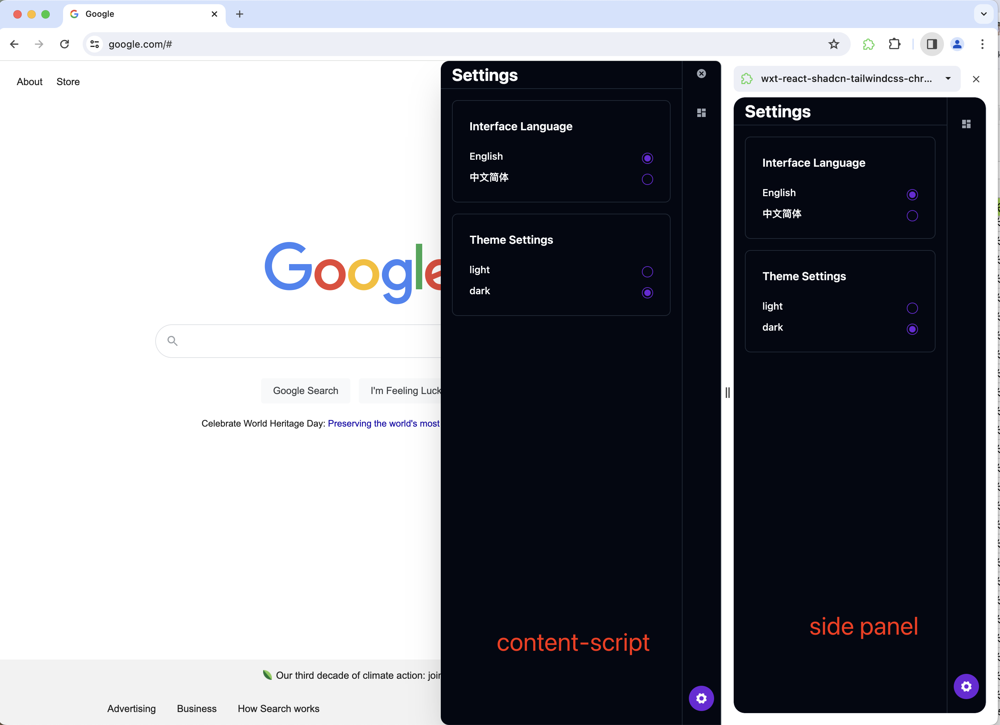
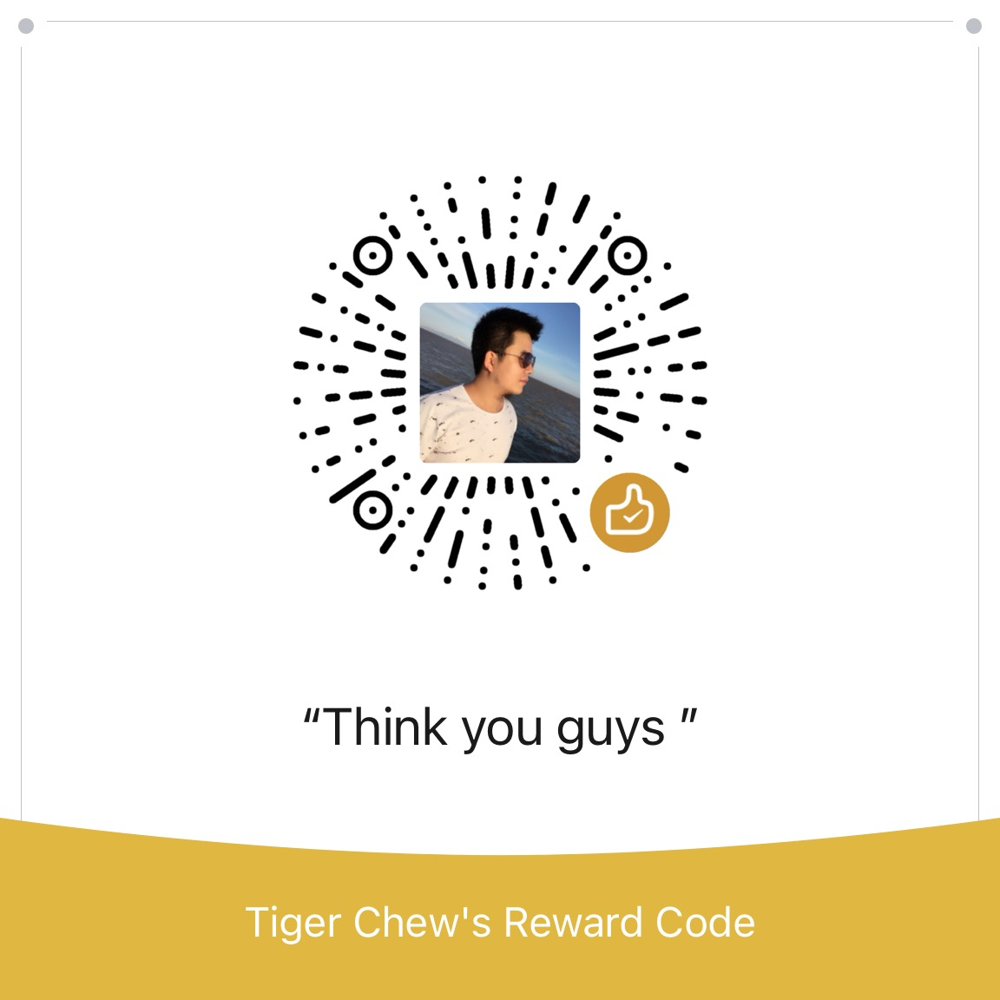

<p align="center">
   <video src="demo/demo.mp4"></video>
  
</p>
<p align="center">
  <em>This is a boilerplate and starter for Chrome browser extension, built with Wxt、 React、 Tailwind css 、Shadcn ui and Typescript.
Support dark mode and localization </em>
</p>
<p align="center">
    
      <a href="#"></a>
  <a href="#"></a>
</p>

<p align="center">
<span>&nbsp;&nbsp;•&nbsp;&nbsp;</span>
<a href="https://twitter.com/imtigerchew" target="_blank">🐦 X About me</a>
</p>

---

## 🔐 Prerequisites :point_up:

Before you get started, please make sure you have the following installed:

- An editor of your choice. For example, webstorm,[Visual Studio Code (VS Code)](https://code.visualstudio.com/download)
- [Node.js](https://nodejs.org/en/download)
- [Git](https://git-scm.com/downloads)

## 🗂️ Getting Started :rocket:
1. **Open your editor**

2. **Open the Terminal** 
   - Typically, you can do this from a 'Terminal' tab or by using a shortcut
     (e.g., `Ctrl + ~` for Windows or `Control + ~` for Mac in VS Code).

3. **Clone the Repository and Navigate into the Directory** 
   - Once your terminal is open, you can clone the repository and move into the directory by running the commands below.

   - **For Mac/Linux users** :apple: :penguin:
   ```bash
   git clone git@github.com:imtiger/wxt-react-shadcn-tailwindcss-chrome-extension.git
   cd wxt-react-shadcn-tailwindcss-chrome-extension
   npm install
   npm run dev
   ```
   - **For Windows users** :windows:
   ```bash
   git clone git@github.com:imtiger/wxt-react-shadcn-tailwindcss-chrome-extension.git
   cd wxt-react-shadcn-tailwindcss-chrome-extension
   npm install
   npm run dev
   ```
4. **The browser will be auto opened**
   - you will see the content-script panel and side panel


## ❇️ Tech Stack

- ✅ **Wxt**: [Wxt](https://wxt.dev)
- ✅ **React**: [React](https://react.dev/)
- ✅ **Tailwind css**: [Tailwind css](https://tailwindcss.com)
- ✅ **Shadcn UI**: [Shadcn UI](https://ui.shadcn.com)

## 🚀 Localization and i18n 

The locales file in the locales folder ,and you can edit it.
- [locales](locales)
- [i18nConfig.ts](components/i18nConfig.ts)
- [i18n.ts](components/i18n.ts)
- you can call initTranslation method in the [i18n.ts](components/i18n.ts) with different namespaces ,and only load the namespace json file.
```typescript
initTranslations(i18nConfig.defaultLocale, ["common", "content"])
```

## 👀 Considerations
- Chrome extension tailwind css rem not working shadow dom.

Because Tailwind CSS uses rem by default, and rem is computed based on the font-size of the html element on the page, even if a content-script uses shadow dom, the internal elements' rem are also calculated based on the root html element's font-size of the host page. Therefore, to prevent style differences in the plugin due to varying font-sizes set by different websites, we can modify the default configuration of Tailwind CSS, allowing it to calculate directly in pixels.

```bash
npm install @thedutchcoder/postcss-rem-to-px
   ```
```typescript
//postcss.config.js
export default {
   plugins: {
      tailwindcss: {},
      '@thedutchcoder/postcss-rem-to-px': {}, // you can add option like the base font size
      autoprefixer: {},
   },    
};
```
- Add new component
```bash
npx shadcn-ui@latest add
```
- Not trigger the click event listener.

  When a popup or side panel is defined, and set
```typescript
browser.sidePanel.setPanelBehavior({openPanelOnActionClick: true}).catch((error: any) => console.error(error));
```
clicking on the browser extension icon won't trigger the listening event,and just open the side panel.
```typescript
//monitor the event from extension icon click
browser.action.onClicked.addListener((tab) => {
   // 发送消息给content-script.js
   console.log("click icon")
   console.log(tab)
   browser.tabs.sendMessage(tab.id!, {messageType: MessageType.clickExtIcon});
});
```

## 👨‍🚀About Me

- Full-Stack Engineer

- Once worked at Tencent and Alibaba

[Github](https://github.com/imtigerchew)  
[Twitter/X](https://twitter.com/imtigerchew)  

If this project is helpful to you, star the repo and buy be a coffee, thank you guys.

<a href="https://www.buymeacoffee.com/imtigerchew" target="_blank"></a>

